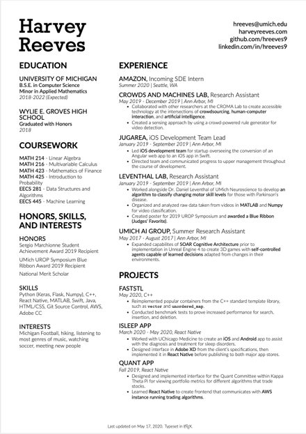

# LaTeXResumeTemplate

This repository provides a template for a modern, two-column resume typeset in LaTeX.

Adapted from [Deedy-Resume](https://github.com/deedy/Deedy-Resume), this template provides a clean, readable look, and an easy class syntax so it can be used as a template. 

**Be sure to compile with XeLaTeX so that fonts work.** To change the fonts in the document, change the main fonts in the class file, and then any subsequent references throughout the file.

Here's a preview of what the resume looks like:

